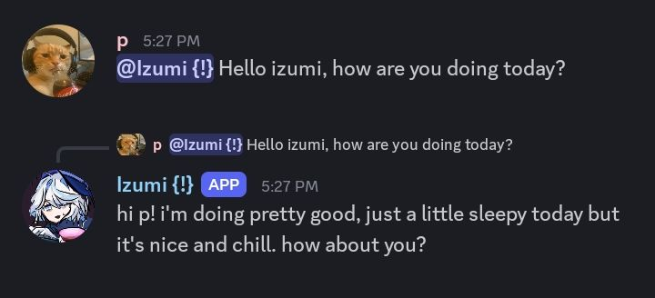
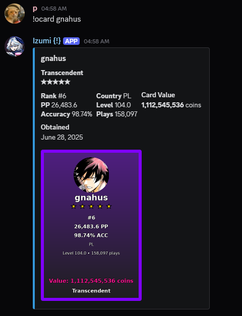
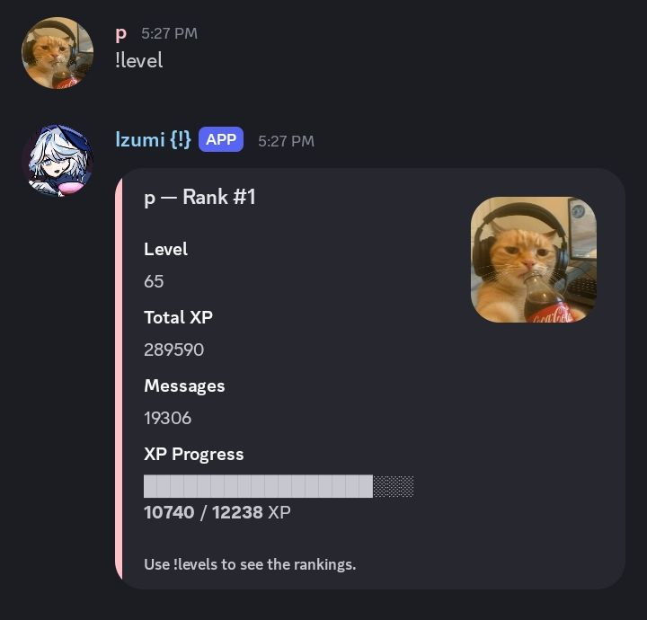
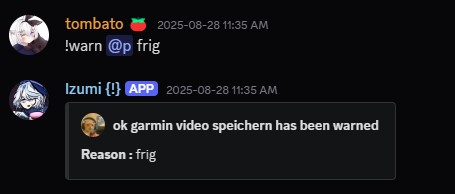
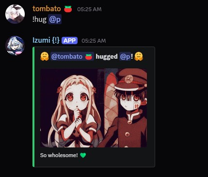

---

# Izumi

Izumi is a Discord bot that mixes useful server tools with various osu features. 

---
## Features

* AI chat powered by Google Gemini



* osu! Gacha 



* Leveling System



* Moderation tools



* Several Social commands



and many more additional features.

---

## 

### Requirements

* Python 3.8+ 
* Discord bot token → [Developer Portal](https://discord.com/developers/applications)
* Gemini API key → [Google AI Studio](https://aistudio.google.com/)
* *(Optional)* osu! API credentials → [osu! settings](https://osu.ppy.sh/home/account/edit)
* *(Optional)* FFmpeg for YouTube video/audio analysis → [FFmpeg Download](https://ffmpeg.org/download.html)

### Install

```bash
git clone https://github.com/dinonuwg/izumi.git
cd izumi
pip install -r requirements.txt
```

### Configure

1. Copy `.env.template` → `.env`
2. Add your tokens and keys
3. Set `BOT_OWNER_ID` to your Discord user ID

Example:

```env
DISCORD_TOKEN=your_token
GEMINI_API_KEY=your_gemini_key
BOT_OWNER_ID=your_id

# Optional for osu! gacha
OSU_CLIENT_ID=your_osu_id
OSU_CLIENT_SECRET=your_osu_secret

COMMAND_PREFIX=!
LOG_LEVEL=INFO
```

### Run

```bash
python bot.py
```

---

## Project Structure

```
├── bot.py          # Main bot entry
├── cogs/           # Features (AI, moderation, osu! gacha)
├── data/           # JSON storage
├── utils/          # Helpers/config
└── requirements.txt
```

---

## Deployment

Scripts are included for both Windows and Linux servers.

**Windows**

* `win_setup.bat` – setup
* `win_run_bot.bat` – run the bot
* `win_transfer_helper.bat` – transfer files to Linux

**Linux**

* `linux_server_setup.sh` – Ubuntu setup with systemd
* `linux_manage_bot.sh` – manage the bot as a service
* `win_to_linux_transfer.sh` – transfer helper

Includes automatic startup, logging, and recovery.

---

## Contributing

The bot is modular, so adding features is straightforward. Fork it, open issues, or submit pull requests.

---

## Credits to

* [discord.py](https://github.com/Rapptz/discord.py)
* [Google Gemini AI](https://aistudio.google.com/)
* [osu! API](https://osu.ppy.sh/)
* Everyone who tested and gave feedback

---